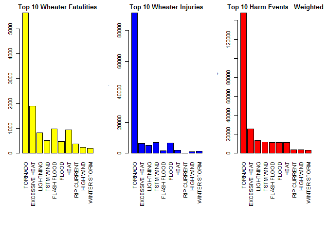
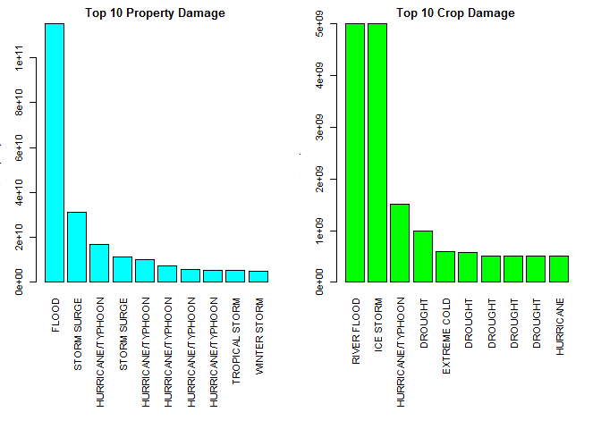

# NOAA Storm Database - Analysis: Severe weather events

# Synopsis

Analyse the impact that different type of Climate events have in the health and economics
in the USA. Data from NOAA storm data base is used for the analysis. 

For the Health analysis, the objective is to identify which events are the most harmful. 
For the economical impact, validate which climate events have caused the most expensive
losses in Properties and in Crops.


# Questions:

The data Analysis will address the following questions:


- Across the United States, which types of events (as indicated in the EVTYPE variable) are
most harmful with respect to population health?


- Across the United States, which types of events have the greatest economic consequences?


# Data processing

## Reading the Data


```r
# for Reading Files *ZIP
fileUrl <- "https://d396qusza40orc.cloudfront.net/repdata%2Fdata%2FStormData.csv.bz2"
download.file(fileUrl, "dataset.zip")
Rawdata <- read.csv("dataset.zip", header = TRUE, sep = ",", check.names = TRUE, stringsAsFactors=FALSE)
```


The variable **BGN_DATE** represent a Date and is being shown as "Factor". To convert to type: "Date"


```r
#Make a copy of data to avoid reading again the file
Rawdata2 <- Rawdata
Rawdata2$BGN_DATE <- as.Date(Rawdata2$BGN_DATE, "%m/%d/%Y")
#validate if type of data for "Date" has changed
str(Rawdata2$BGN_DATE)
```

```
##  Date[1:902297], format: "1950-04-18" "1950-04-18" "1951-02-20" "1951-06-08" "1951-11-15" ...
```


## First Question

**The first Questions is to know which Event Type has been more harmful with respect to
population.**

The first approach is to validate wich Event Type has occurred more times


```r
EventTypeSummary <- table(Rawdata2$EVTYPE)
EventTypeSummary <- data.frame(EventTypeSummary)
EventTypeSummary <- arrange(EventTypeSummary, desc(Freq))
head(EventTypeSummary, 5)
```

```
##                Var1   Freq
## 1              HAIL 288661
## 2         TSTM WIND 219940
## 3 THUNDERSTORM WIND  82563
## 4           TORNADO  60652
## 5       FLASH FLOOD  54277
```

From this table, we can assure that **HAIL** is the event that happens
the most in USA. Nevertheless, it does not guarantee that it is the most harmful for the 
population.

To validate the Harmfulness, the **"Fatalities"** and **"Injuries"** caused by the events will be
analyzed.


```r
FatalitiesInjuries <- subset(Rawdata2, select =  c(EVTYPE, FATALITIES, INJURIES))
EvFatalities <- aggregate(FatalitiesInjuries$FATALITIES, by = list(FatalitiesInjuries$EVTYPE), FUN = sum)
EvInjuries <- aggregate(FatalitiesInjuries$INJURIES, by = list(FatalitiesInjuries$EVTYPE), FUN = sum)
#Order the Data from Higher to lower to see the events with more fatal and injure events:

EvFatalities <- arrange(EvFatalities, desc(x))
EvInjuries <- arrange(EvInjuries, desc(x))
HarmfulEvents <- merge(EvFatalities, EvInjuries, by = "Group.1", all = TRUE)
HarmfulEvents <- arrange(HarmfulEvents, desc(x.x))
names <- c("EVTYPE", "FATALITIES", "INJURIES")
colnames(HarmfulEvents) <- names
head(HarmfulEvents, 5)
```

```
##           EVTYPE FATALITIES INJURIES
## 1        TORNADO       5633    91346
## 2 EXCESSIVE HEAT       1903     6525
## 3    FLASH FLOOD        978     1777
## 4           HEAT        937     2100
## 5      LIGHTNING        816     5230
```

Here, one can see that **TORNADO** and **EXCESSIVE HEAT** have the higher values in Fatalities.
Comparing with the frequency of the events (Table shown above "EventTypeSummary"), the 
Frequency of the events is not directly related with the Harmfulness. 

Considering that the Fatal cases are worst as the Injuries, but without taking out of consideration
the injuries, a Weighted calculation is made, where a weight of "5" is given to "Fatality"
and a Weight of "1" to "Injury"


```r
HarmfulEvents2 <- HarmfulEvents
HarmfulEvents2 <- HarmfulEvents2 %>% mutate(WeightedValue = FATALITIES*5 + INJURIES)
HarmfulEvents2 <- arrange(HarmfulEvents2, desc(WeightedValue))
head(HarmfulEvents2, 5)
```

```
##           EVTYPE FATALITIES INJURIES WeightedValue
## 1        TORNADO       5633    91346        119511
## 2 EXCESSIVE HEAT       1903     6525         16040
## 3      TSTM WIND        504     6957          9477
## 4      LIGHTNING        816     5230          9310
## 5          FLOOD        470     6789          9139
```

With this conisderation, the most harmful event is the **TORNADO**, followed by the **EXCESIVE HEAT**.


To be clear with the **"Weighted value"**, this result might vary according to the weight given
to the "FATALITY". To validate its impact, another calculation with a higher weight is made to see
if the top 3 events vary:


```r
HarmfulEvents2 <- HarmfulEvents
HarmfulEvents2 <- HarmfulEvents2 %>% mutate(WeightedValue = FATALITIES*10 + INJURIES)
HarmfulEvents2 <- arrange(HarmfulEvents2, desc(WeightedValue))
head(HarmfulEvents2, 3)
```

```
##           EVTYPE FATALITIES INJURIES WeightedValue
## 1        TORNADO       5633    91346        147676
## 2 EXCESSIVE HEAT       1903     6525         25555
## 3      LIGHTNING        816     5230         13390
```

### Answer Question 1
* It is clear that **TORNADO** and **EXCESIVE HEAT** are the 2 most harmful events in the USA.


## Second Question

**Identify which types of events have the greatest economic consequences**

Identify which variables are related with Economic Consecuences:

* **PROPDMG**   : Property Damage. Number of Property damaged
* **PROPDMGEXP**: Property Damage Exponential. " ",-, ?, +, 0, 1, 2, 3, 4, 5, 6, 7, 8, B, h, H, K, m, M,
* **CROPDMG**   : Crop Damage. Number of Crop damage
* **CROPDMGEXP**: Crop Damage Exponential. ?,  0,  2,  B,  k,  K,  m,  M

According to a validation made by _Soesilo Wijono_ in an article published in RPubs,
[RPubs Link](https://rpubs.com/flyingdisc/PROPDMGEXP), the equivalents are as follows:

* H,h = hundreds = 100

* K,k = kilos = thousands = 1,000

* M,m = millions = 1,000,000

* B,b = billions = 1,000,000,000

* (+) = 1

* (-) = 0

* (?) = 0

* black/empty character = 0

* numeric 0..8 = 10


To avoid working with all complete data set, a new data set is created using only the 
necessary variables


```r
EconomicVariables <- subset(Rawdata2, select =  c(EVTYPE, PROPDMG, PROPDMGEXP, CROPDMG, CROPDMGEXP))
str(EconomicVariables)
```

```
## 'data.frame':	902297 obs. of  5 variables:
##  $ EVTYPE    : Factor w/ 985 levels "   HIGH SURF ADVISORY",..: 834 834 834 834 834 834 834 834 834 834 ...
##  $ PROPDMG   : num  25 2.5 25 2.5 2.5 2.5 2.5 2.5 25 25 ...
##  $ PROPDMGEXP: Factor w/ 19 levels "","-","?","+",..: 17 17 17 17 17 17 17 17 17 17 ...
##  $ CROPDMG   : num  0 0 0 0 0 0 0 0 0 0 ...
##  $ CROPDMGEXP: Factor w/ 9 levels "","?","0","2",..: 1 1 1 1 1 1 1 1 1 1 ...
```


Using the previous table, the equivalents values are assigned accordingly for __Property__


```r
EconomicVariables$PROPEXP[EconomicVariables$PROPDMGEXP == "H"] <- 100
EconomicVariables$PROPEXP[EconomicVariables$PROPDMGEXP == "h"] <- 100
EconomicVariables$PROPEXP[EconomicVariables$PROPDMGEXP == "K"] <- 1000
EconomicVariables$PROPEXP[EconomicVariables$PROPDMGEXP == "k"] <- 1000
EconomicVariables$PROPEXP[EconomicVariables$PROPDMGEXP == "M"] <- 1000000
EconomicVariables$PROPEXP[EconomicVariables$PROPDMGEXP == "m"] <- 1000000
EconomicVariables$PROPEXP[EconomicVariables$PROPDMGEXP == "B"] <- 1000000000
EconomicVariables$PROPEXP[EconomicVariables$PROPDMGEXP == "b"] <- 1000000000
EconomicVariables$PROPEXP[EconomicVariables$PROPDMGEXP == "+"] <- 1
EconomicVariables$PROPEXP[EconomicVariables$PROPDMGEXP == "-"] <- 0
EconomicVariables$PROPEXP[EconomicVariables$PROPDMGEXP == "?"] <- 0
EconomicVariables$PROPEXP[EconomicVariables$PROPDMGEXP == " "] <- 0
EconomicVariables$PROPEXP[EconomicVariables$PROPDMGEXP == ""] <- 0
EconomicVariables$PROPEXP[EconomicVariables$PROPDMGEXP == "0"] <- 0
EconomicVariables$PROPEXP[EconomicVariables$PROPDMGEXP == "1"] <- 0
EconomicVariables$PROPEXP[EconomicVariables$PROPDMGEXP == "2"] <- 0
EconomicVariables$PROPEXP[EconomicVariables$PROPDMGEXP == "3"] <- 0
EconomicVariables$PROPEXP[EconomicVariables$PROPDMGEXP == "4"] <- 0
EconomicVariables$PROPEXP[EconomicVariables$PROPDMGEXP == "5"] <- 0
EconomicVariables$PROPEXP[EconomicVariables$PROPDMGEXP == "6"] <- 0
EconomicVariables$PROPEXP[EconomicVariables$PROPDMGEXP == "7"] <- 0
EconomicVariables$PROPEXP[EconomicVariables$PROPDMGEXP == "8"] <- 0
```

Using the previous table, the equivalents values are assigned accordingly for __Crop__


```r
EconomicVariables$CROPEXP[EconomicVariables$CROPDMGEXP == ""] <- 0
EconomicVariables$CROPEXP[EconomicVariables$CROPDMGEXP == "M"] <- 1000000
EconomicVariables$CROPEXP[EconomicVariables$CROPDMGEXP == "K"] <- 1000
EconomicVariables$CROPEXP[EconomicVariables$CROPDMGEXP == "m"] <- 1000000
EconomicVariables$CROPEXP[EconomicVariables$CROPDMGEXP == "B"] <- 1000000000
EconomicVariables$CROPEXP[EconomicVariables$CROPDMGEXP == "?"] <- 0
EconomicVariables$CROPEXP[EconomicVariables$CROPDMGEXP == "0"] <- 0
EconomicVariables$CROPEXP[EconomicVariables$CROPDMGEXP == "k"] <- 1000
EconomicVariables$CROPEXP[EconomicVariables$CROPDMGEXP == "2"] <- 0
```

Having the equivalences for both _PROPERTY_ and _CROP_, we can calculate the final value


```r
EconomicVariables$PROPValue <- EconomicVariables$PROPDMG * EconomicVariables$PROPEXP
EconomicVariables$CROPValue <- EconomicVariables$CROPDMG * EconomicVariables$CROPEXP

# To see the top 5 Types of events with most Property Damage
top10Prop <- arrange(EconomicVariables, desc(PROPValue))[1:10, ]
head(top10Prop, 5)
```

```
##   STATE   BGN_DATE            EVTYPE PROPDMG PROPDMGEXP CROPDMG CROPDMGEXP
## 1    CA 2006-01-01             FLOOD  115.00          B    32.5          M
## 2    LA 2005-08-29       STORM SURGE   31.30          B     0.0           
## 3    LA 2005-08-28 HURRICANE/TYPHOON   16.93          B     0.0           
## 4    MS 2005-08-29       STORM SURGE   11.26          B     0.0           
## 5    FL 2005-10-24 HURRICANE/TYPHOON   10.00          B     0.0           
##   PROPEXP CROPEXP PROPValue CROPValue
## 1   1e+09   1e+06 1.150e+11  32500000
## 2   1e+09   0e+00 3.130e+10         0
## 3   1e+09   0e+00 1.693e+10         0
## 4   1e+09   0e+00 1.126e+10         0
## 5   1e+09   0e+00 1.000e+10         0
```

```r
# To see the top 5 Types of events with most Crop Damage
top10crop <- arrange(EconomicVariables, desc(CROPValue))[1:10, ]
head(top10crop, 5)
```

```
##   STATE   BGN_DATE            EVTYPE PROPDMG PROPDMGEXP CROPDMG CROPDMGEXP
## 1    IL 1993-08-31       RIVER FLOOD    5.00          B    5.00          B
## 2    MS 1994-02-09         ICE STORM  500.00          K    5.00          B
## 3    MS 2005-08-29 HURRICANE/TYPHOON    5.88          B    1.51          B
## 4    TX 2006-01-01           DROUGHT    0.00               1.00          B
## 5    CA 1998-12-20      EXTREME COLD    0.00             596.00          M
##   PROPEXP CROPEXP PROPValue CROPValue
## 1   1e+09   1e+09  5.00e+09  5.00e+09
## 2   1e+03   1e+09  5.00e+05  5.00e+09
## 3   1e+09   1e+09  5.88e+09  1.51e+09
## 4   0e+00   1e+09  0.00e+00  1.00e+09
## 5   0e+00   1e+06  0.00e+00  5.96e+08
```


### Answer Question 2
* In _Properties_, the biggest consecueces are due to **FLOOD** and for _Crops_ are due to
**River Flood**.


# Results

## Question 1


```r
par(mfrow = c(1,3), mar = c(12,3,2,2), mgp = c(3,1,0), cex = 0.7)
barplot(HarmfulEvents2$FATALITIES[1:10], las = 3, names.arg = HarmfulEvents2$EVTYPE[1:10], main = "Top 10 Wheater Fatalities", ylab = "# fatalities", col = "yellow")
barplot(HarmfulEvents2$INJURIES[1:10], las = 3, names.arg = HarmfulEvents2$EVTYPE[1:10], main = "Top 10 Wheater Injuries", ylab = "# Injuries", col = "blue")
barplot(HarmfulEvents2$WeightedValue[1:10], las = 3, names.arg = HarmfulEvents2$EVTYPE[1:10], main = "Top 10 Harm Events - Weighted", ylab = "# Harm - Weighted", col = "red")
```

<!-- -->

**Tornado** is the event that causes more harm in USA, Followed by **Excessive Heat**. 
The third graph is a weighted representation of the events that causes more harm,
considering fatality events worse than injuries (Weighted calculation).

## Question 2

```r
par(mfrow = c(1,2), mar = c(12,3,2,2), mgp = c(3,1,0), cex = 0.7)
barplot(top10Prop$PROPValue, las = 3, names.arg = top10Prop$EVTYPE, main = "Top 10 Property Damage", ylab = "$ Property loss", col = "cyan")
barplot(top10crop$CROPValue, las = 3, names.arg = top10crop$EVTYPE, main = "Top 10 Crop Damage", ylab = "$ Crop loss", col = "green")
```

<!-- -->

For **Property** the biggest loosses are casued by **Floods**.
For **Crop** the biggest losses are caused by **River Floods** 


.
.


Complete project and information available in [GitHub Link](https://github.com/luquencio/Severe_weather_events)

.
.


End of Document
